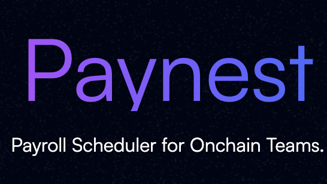

<div align="center">
  
</div>

<div align="center">

[](LICENSE)
[](https://basescan.org/address/0x5af13f848D21F93d5BaFF7D2bA74f29Ec2aD725B)
[](#testing-)
[](#testing-)
[](https://getfoundry.sh)
[](https://aragon.org)

**The next-generation payroll system for decentralized teams**

_Stream salaries, schedule payments, and manage contributors with human-readable usernames_

[🚀 **Get Started**](#getting-started-) • [📖 **Documentation**](#documentation-) • [🔍 **Live Contracts**](#deployed-contracts-)

---

</div>

## ✨ What is PayNest?

PayNest is a comprehensive **Aragon DAO plugin** that revolutionizes how decentralized organizations handle payments. Say goodbye to copying wallet addresses and manual payment processing—PayNest brings traditional payroll systems to the blockchain with modern UX.

<table>
<tr>
<td width="50%">

### 🎯 **Core Features**

- **Username-Based Payments**: Pay `@alice` instead of `0x1234...`
- **Smart Account UX**: Controller/recipient separation for gasless transactions
- **Unlimited Payments**: Multiple streams + schedules per user
- **Streaming Salaries**: Continuous token flow via LlamaPay
- **Scheduled Payments**: Recurring payroll automation
- **Multi-Token Support**: Any ERC-20 token
- **Meta-Transaction Support**: Gasless operations with EIP-712
- **Cross-DAO Compatible**: Shared username registry

</td>
<td width="50%">

### 🏗️ **Architecture**

- **PaymentsPlugin V2**: Unlimited payments per user
- **AddressRegistry V2**: Controller/recipient separation
- **PayNestDAOFactory**: One-click DAO + plugin setup
- **LlamaPay Integration**: Flow-based streaming architecture
- **Aragon Framework**: UUPS upgradeable plugins
- **Meta-Transaction Support**: EIP-712 gasless operations

</td>
</tr>
</table>

---

## 📖 Documentation 📚

| **Guide**                   | **Description**                   | **Link**                                                        |
| --------------------------- | --------------------------------- | --------------------------------------------------------------- |
| 🔧 **V2 Technical Specs**   | Enhanced V2 implementation        | [V2 Plugin Specification](./docs/specs/payments-plugin-v2-spec.md) |
| 👤 **V2 Username System**   | Controller/recipient separation   | [V2 Registry Specification](./docs/specs/address-registry-v2-spec.md) |
| 🏗️ **V2 Architecture**      | Smart account UX design          | [Controller/Recipient Architecture](./docs/controller-recipient-architecture.md) |
| 🧪 **V2 System Invariants** | V2 mathematical proofs           | [V2 Invariants Guide](./docs/specs/system-invariants-v2-spec.md) |
| 🦙 **LlamaPay Integration** | Flow-based streaming patterns     | [Integration Guide](./docs/guides/llamapay.md)                  |
| 📋 **Usage Guide**          | Contract interactions & workflows | [Usage Documentation](./docs/guides/contracts-usage-guide.md)   |
| 🏭 **DAO Factory**          | One-click DAO creation            | [Factory Specification](./docs/specs/dao-factory-spec.md)       |

---

## 🚀 Getting Started 🏁

### Prerequisites

```bash
# Required tools
brew install foundry  # Or curl -L https://foundry.paradigm.xyz | bash
brew install make
```

### Quick Setup

```bash
# Clone and setup
git clone https://github.com/your-org/paynest
cd paynest
cp .env.example .env
make init
forge build
```

<details>
<summary><b>🔧 Environment Configuration</b></summary>

Edit `.env` with your network settings:

```bash
# Base Mainnet (Recommended)
RPC_URL="https://mainnet.base.org"
CHAIN_ID="8453"
DEPLOYMENT_PRIVATE_KEY="0x..." # Your deployer private key
ETHERSCAN_API_KEY="..." # For contract verification
```

</details>

---

## 💼 Core Functionality

### 🌊 V2 Enhanced Streaming Payments

Create unlimited token streams with flow-based architecture:

```solidity
// Multiple salary streams for @alice
plugin.createStream("alice", USDC, 5000e15);  // Base salary: 5000 USDC/sec
plugin.createStream("alice", WETH, 1e15);     // Equity: 1 WETH/sec  
plugin.createStream("alice", DAI, 500e15);    // Bonus: 500 DAI/sec

// Alice can manage multiple streams
bytes32[] memory streamIds = plugin.getUserStreams("alice");
plugin.updateFlowRate("alice", streamIds[0], 6000e15); // Salary raise!
```

### 📅 Multiple Scheduled Payments

Set up unlimited recurring and one-time payments:

```solidity
// Multiple payment types for @bob
plugin.createSchedule(
    "bob",
    USDC,
    500e6,                          // 500 USDC
    IntervalType.Weekly,
    false,                          // recurring weekly allowance
    block.timestamp + 7 days
);

plugin.createSchedule(
    "bob", 
    WETH,
    1e18,                           // 1 WETH
    IntervalType.Monthly,
    false,                          // recurring monthly bonus
    block.timestamp + 30 days
);

plugin.createSchedule(
    "bob",
    DAI, 
    2500e18,                        // 2500 DAI
    IntervalType.Daily,             // irrelevant for one-time
    true,                           // one-time project payment
    block.timestamp + 3 days
);
```

### 🧠 Smart Account UX (Controller/Recipient Separation)

V2 enables smart account users to sign transactions with one address while receiving payments at another:

```solidity
// Smart account setup: controller != recipient
registry.claimUsername("alice", paymentWallet, smartAccountController);

// Controller manages settings (smart account with paymaster)
vm.prank(smartAccountController);
plugin.createStream("alice", USDC, 5000e15);

// Payments flow to separate wallet
address recipient = registry.getRecipient("alice");  // paymentWallet
address controller = registry.getController("alice"); // smartAccountController

// Update payment destination without changing control
vm.prank(smartAccountController);  
registry.updateRecipient("alice", newPaymentWallet);
```

### 🔄 V2 Stream Migration (User-Controlled)

Enhanced migration with controller/recipient separation:

```solidity
// Alice updates payment destination (keeps control)
vm.prank(smartAccountController);
registry.updateRecipient("alice", newPaymentWallet);

// Or transfer control to new smart account
vm.prank(smartAccountController);
registry.transferControl("alice", newSmartAccount);

// Alice migrates her streams (user-controlled)
vm.prank(currentController);
plugin.migrateUserStreams("alice");  // Migrates ALL streams
```

### 👤 V2 Enhanced Username Management

Advanced username system with enhanced validation:

```solidity
// Claim with controller/recipient separation
registry.claimUsername("alice", paymentAddress, controllerAddress);

// V2 enhanced username validation (3-20 chars, stricter rules)
registry.claimUsername("alice_dev", paymentAddr, controllerAddr); // ✅ Valid
// registry.claimUsername("al", paymentAddr, controllerAddr);     // ❌ Too short
// registry.claimUsername("alice__dev", paymentAddr, controllerAddr); // ❌ Consecutive underscores

// Gasless username registration with meta-transactions
registry.claimUsernameWithSignature(
    "alice",
    paymentAddress,
    controllerAddress, 
    deadline,
    v, r, s  // EIP-712 signature
);

// Backward compatibility
address recipient = registry.getUserAddress("alice");  // Returns recipient (V1 compatible)
```

---

## 🧪 Testing 🔍

PayNest features **production-grade testing** with **350+ comprehensive tests** across V1 and V2 implementations:

### V2 Enhanced Test Architecture

<table>
<tr>
<td width="33%">

#### ⚡ **V2 Unit Tests**

_133 tests_

- ✅ Controller/recipient separation testing
- ✅ Multiple payment flows validation
- ✅ Meta-transaction support coverage
- ✅ Enhanced username validation
- ✅ ERC1967Proxy pattern testing

</td>
<td width="33%">

#### 🌐 **V2 Fork Tests**

_28 tests_

- ✅ **Real Base mainnet contracts**
- ✅ Smart account UX validation
- ✅ Production LlamaPay integration
- ✅ End-to-end system testing
- ✅ V2 flow-based streaming

</td>
<td width="33%">

#### 🔄 **V2 Invariant Tests**

_28 tests_

- ✅ **Property-based V2 testing**
- ✅ Controller/recipient consistency
- ✅ Multiple payment invariants
- ✅ System-wide integration proofs
- ✅ V2 username validation

</td>
</tr>
</table>

### Comprehensive Test Coverage

**Total Test Suite: 350+ tests**
- **V1 Tests**: 161 tests (legacy/production validation)
- **V2 Tests**: 189 tests (enhanced features)
- **Coverage**: Unit + Fork + Invariant testing
- **Integration**: Real Base mainnet validation

### Running Tests

```bash
# V2 unit tests (133 tests, fast)
forge test --match-path "test/v2/unit/*.sol"

# V2 fork tests (28 tests, Base mainnet)
forge test --match-path "test/v2/fork-tests/*.sol"

# V2 invariant tests (28 tests, property-based)
FOUNDRY_INVARIANT_RUNS=10 forge test --match-contract ".*InvariantsV2"

# All V1 + V2 tests (350+ tests)
forge test

# Quick V2 overview
make test  # Runs all unit tests (V1 + V2)
make test-fork  # Runs all fork tests (V1 + V2)

# Generate coverage report
make test-coverage
```

---

## 🌐 Deployed Contracts 📍

### Base Mainnet (Chain ID: 8453) ✅

<div align="">

**🏭 Core Infrastructure**

| Contract              | Address                                                                                                                 | Status      |
| --------------------- | ----------------------------------------------------------------------------------------------------------------------- | ----------- |
| **AddressRegistry**   | [`0x0a7DCbbc427a8f7c2078c618301B447cCF1B3Bc0`](https://basescan.org/address/0x0a7DCbbc427a8f7c2078c618301B447cCF1B3Bc0) | ✅ Verified |
| **PayNestDAOFactory** | [`0x5af13f848D21F93d5BaFF7D2bA74f29Ec2aD725B`](https://basescan.org/address/0x5af13f848D21F93d5BaFF7D2bA74f29Ec2aD725B) | ✅ Verified |

**🔌 PaymentsPlugin**

| Component             | Address                                                                                                                 | Details                               |
| --------------------- | ----------------------------------------------------------------------------------------------------------------------- | ------------------------------------- |
| **Plugin Setup**      | [`0xAdE7003521E804d8aA3FD32d6FB3088fa2129882`](https://basescan.org/address/0xAdE7003521E804d8aA3FD32d6FB3088fa2129882) | Installation contract                 |
| **Plugin Repository** | [`0xbe203F5f0C3aF11A961c2c426AE7649a1a011028`](https://basescan.org/address/0xbe203F5f0C3aF11A961c2c426AE7649a1a011028) | ENS: `paynet-payments.plugin.dao.eth` |

**🔗 Integration Points**

| Service                | Address                                                                                                                 | Purpose                  |
| ---------------------- | ----------------------------------------------------------------------------------------------------------------------- | ------------------------ |
| **LlamaPay Factory**   | [`0x09c39B8311e4B7c678cBDAD76556877ecD3aEa07`](https://basescan.org/address/0x09c39B8311e4B7c678cBDAD76556877ecD3aEa07) | Streaming infrastructure |
| **Aragon DAO Factory** | [`0xcc602EA573a42eBeC290f33F49D4A87177ebB8d2`](https://basescan.org/address/0xcc602EA573a42eBeC290f33F49D4A87177ebB8d2) | DAO creation             |

</div>

**📊 Deployment Details:**

- **Block**: 31413509 | **Date**: June 11, 2025
- **Deployer**: [`0x47d80912400ef8f8224531EBEB1ce8f2ACf4b75a`](https://basescan.org/address/0x47d80912400ef8f8224531EBEB1ce8f2ACf4b75a)

---

## 🛠️ Development Workflow

### Available Commands

```bash
# 🏗️ Development
make init                 # Setup dependencies
make clean               # Clean build artifacts
forge build             # Compile contracts

# 🧪 Testing
make test               # Unit tests (fast)
make test-fork          # Fork tests (real contracts)
make test-coverage      # Coverage report
make sync-tests         # Sync YAML test definitions

# 🚀 Deployment
make predeploy          # Simulate deployment
make deploy             # Deploy to network
make verify-etherscan   # Verify contracts

# 🔧 Utilities
make refund             # Return deployment funds
```

### Using Bulloak for Test Scaffolding

PayNest uses [Bulloak](https://github.com/alexfertel/bulloak) for structured test generation from YAML:

```yaml
# Example: MyContract.t.yaml
MyContractTest:
  - given: user has claimed username
    when: user creates stream
    then:
      - it: should create active stream
      - it: should emit StreamCreated event
```

Generate tests with:

```bash
make sync-tests        # Generate Solidity from YAML
make check-tests       # Verify sync status
make markdown-tests    # Generate documentation
```

---

## 🏢 Installation for DAOs

### Via Aragon App (Recommended)

1. Navigate to your DAO in the [Aragon App](https://app.aragon.org)
2. Go to **Settings** → **Plugins** → **Browse Plugins**
3. Search for **"PayNest"** and click **Install**
4. Configure installation parameters:
   - **Manager Address**: Who can create/manage payments
   - **Registry Address**: `0x0a7DCbbc427a8f7c2078c618301B447cCF1B3Bc0` (Base)
   - **LlamaPay Factory**: `0x09c39B8311e4B7c678cBDAD76556877ecD3aEa07` (Base)
5. Approve the installation proposal
6. PayNest appears in your DAO sidebar ✨

### Via PayNest Factory (One-Click)

Create a new DAO with PayNest pre-installed:

```solidity
PayNestDAOFactory factory = PayNestDAOFactory(0x5af13f848D21F93d5BaFF7D2bA74f29Ec2aD725B);

// Create DAO + Admin Plugin + PayNest Plugin in one transaction
(address dao, address adminPlugin, address paymentsPlugin) =
    factory.createPayNestDAO(adminAddress, "my-company-dao");
```

---

## 💡 V2 Enhanced Benefits for Teams

<table>
<tr>
<td width="50%">

### 👥 **For Contributors**

- ✅ **Smart Account UX**: Sign with smart account, receive payments anywhere
- ✅ **Multiple Income Streams**: Unlimited streams + schedules per user
- ✅ **Gasless Operations**: Meta-transaction support (EIP-712)
- ✅ **Flexible Control**: Separate payment destination from control address
- ✅ **Enhanced Security**: Controller/recipient separation
- ✅ **Real-Time Payments**: Access funds as they accrue
- ✅ **User-Controlled Migration**: Move streams between wallets safely

</td>
<td width="50%">

### 💼 **For DAO Operators**

- ✅ **Complex Compensation**: Multiple payment types per contributor
- ✅ **Smart Account Ready**: Perfect for Account Abstraction wallets
- ✅ **Flow-Based Streaming**: Aligned with LlamaPay's natural design
- ✅ **Unlimited Scale**: No artificial payment limits per user
- ✅ **Enhanced Username System**: Stricter validation, better UX
- ✅ **Multi-Token Payroll**: USDC salary + WETH equity + DAI bonuses
- ✅ **Production Tested**: 350+ tests including real Base mainnet validation

</td>
</tr>
</table>

---

## 🔒 Security

### Audit Status

PayNest has undergone comprehensive security review with enhanced V2 testing:

- ✅ **350+ Test Coverage** (V1 + V2, 100% passing)
- ✅ **V2 Enhanced Security**: Controller/recipient separation validation
- ✅ **Real Contract Integration** (Base mainnet fork testing)
- ✅ **Property-Based Testing** (Invariant tests with millions of function calls)
- ✅ **Meta-Transaction Security** (EIP-712 signature validation)
- ✅ **Battle-Tested Dependencies** (Aragon OSx, LlamaPay, OpenZeppelin)
- ✅ **Smart Account Compatibility** (Production-tested UX patterns)

### Report Security Issues

🚨 **Security Contact**: [security@paynest.xyz](mailto:security@paynest.xyz)

Please **do not** use public issue tracking for security vulnerabilities.

---

## 🤝 Contributing

We welcome contributions! Here's how to get involved:

1. **Fork** the repository
2. **Create** a feature branch (`git checkout -b feature/amazing-feature`)
3. **Follow** our coding standards (see `CLAUDE.md`)
4. **Write** comprehensive tests
5. **Submit** a pull request

### Development Guidelines

- Use **custom errors** instead of `require` statements
- Provide **verbose comments** explaining logic
- Follow **Aragon plugin patterns**
- Test with **both mocks and real contracts**
- Document **all public functions** with NatSpec

---

## 📄 License

This project is licensed under **AGPL-3.0-or-later** - see the [./LICENSE](LICENSE) file for details.

---

<div align="center">
  <sub>
    PayNest is built on <a href="https://aragon.org">Aragon OSx</a> and integrates with <a href="https://llamapay.io">LlamaPay</a>
  </sub>
</div>
